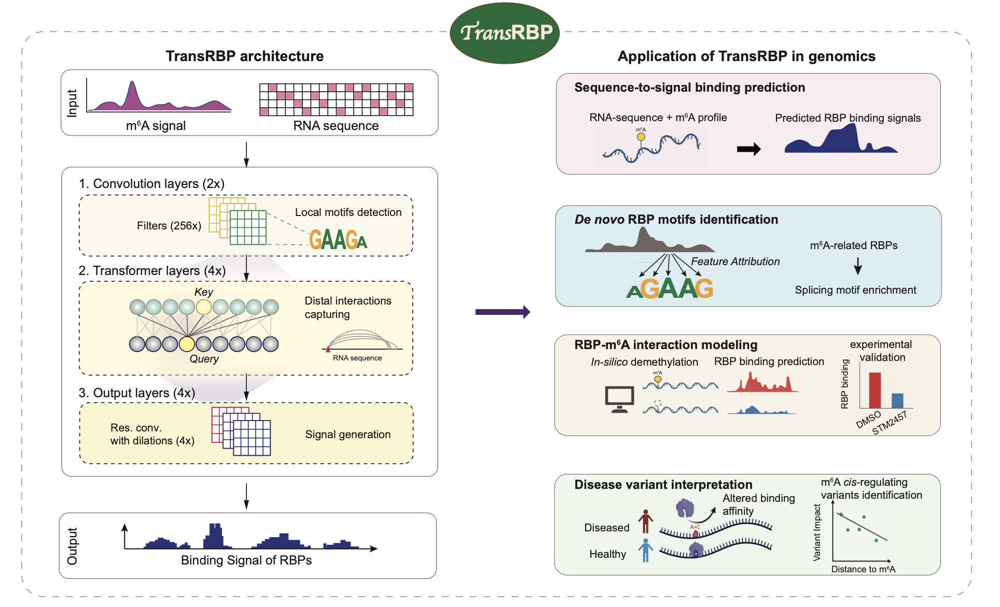

# TransRBP: m<sup>6</sup>A-Aware RBP Binding Prediction

TransRBP predicts RNA-binding protein (RBP) binding signal from sequence using a ResNet-Transformer architecture. The m6A-aware model adds a fifth input channel for m6A MeRIP-seq signal alongside the four-channel RNA one-hot encoding.

This repository contains the full model code, training, evaluation, interpretation (Integrated Gradients), in silico demethylation, and variant impact scoring.



---

## Installation

```bash
git clone https://github.com/xiongxslab/TransRBP.git
cd TransRBP

conda env create -f environment.yml
conda activate transrbp

# Install the package in editable mode so all imports work from the repo root
pip install -e .
```


After `pip install -e .`, all scripts can be run directly from the `TransRBP/` directory without any path configuration:

```bash
cd TransRBP/
python evaluation/predict.py --help
```

---

## Download Pre-trained Data (Zenodo)

Pre-trained full model (5-channels) weights and train/val/test BED files for all 32 m6A-associated RBPs are available on Zenodo: [Zenodo](https://zenodo.org/records/21797682)

### How to organise after download

1. **Clone the repo and install:** (See Installation above)

2. **Download from Zenodo and place files inside the repo root.** The expected layout is:

```
TransRBP/                      ← repo root (git clone destination)
├── models/                    ← from Zenodo: pre-trained .pth files
│   ├── AKAP1.pth
│   ├── FMR1.pth
│   ├── UPF1.pth
│   └── ... (32 total)
├── data/                      ← from Zenodo: no-homology train/val/test BED splits
│   ├── FMR1_train.bed
│   ├── FMR1_val.bed
│   ├── FMR1_test.bed
│   └── ... (32 RBPs × 3 splits)
├── hg38/
│   ├── dna_sequence/          ← from Zenodo: per-chromosome gzipped FASTA
│   │   ├── chr1.fa.gz
│   │   ├── chr2.fa.gz
│   │   └── ...
│   └── all/                   ← from Zenodo: combined genome (for variant scoring)
│       ├── hg38.fa
│       └── hg38.fa.fai
├── m6A_bw/                    ← from Zenodo: MeRIP-seq BigWig (two files)
│   ├── m6A_plus.bw
│   └── m6A_minus.bw
├── model/                     ← code (in repo)
├── evaluation/                ← code (in repo)
└── ...
```

The Zenodo deposit contains four top-level folders: `models/`, `data/`, `hg38/`, `m6A_bw/`. Unzip each directly into the repo root.

| Zenodo folder        | Contents                                                                     |
| -------------------- | ---------------------------------------------------------------------------- |
| `models/`            | 32 `.pth` weight files (one per m6A-associated RBP)                          |
| `data/`              | Per-RBP train/val/test BED files (no-homology split)                         |
| `hg38/dna_sequence/` | Per-chromosome gzipped FASTA — used by predict, IG, demethylation            |
| `hg38/all/`          | Combined `hg38.fa` + index — used by variant impact scoring                  |
| `m6A_bw/`            | `m6A_plus.bw` and `m6A_minus.bw` (MeRIP-seq signal)                          |

---

## Quick Start with Pre-trained Models

### 1. Predict binding signal on new regions

Given any set of genomic regions (BED file), the model predicts the RBP binding signal using the local sequence and m6A context. No RBP BigWig is needed.

```bash
python evaluation/predict.py \
  --rbp_name   FMR1 \
  --peak_bed   data/FMR1_test.bed \
  --model_path models/FMR1.pth \
  --chrom_root hg38/dna_sequence \
  --m6A_bw_plus  m6A_bw/m6A_plus.bw \
  --m6A_bw_minus m6A_bw/m6A_minus.bw \
  --output_csv FMR1_predictions.csv \
  --output_h5  FMR1_predictions.h5    # optional: save full 800 bp tracks
```

**Input BED:** standard BED6 format (`chrom, start, end, name, score, strand`). Each row defines one 800 bp window; coordinates are used directly.

**Output CSV columns:**

| Column        | Description                               |
| ------------- | ----------------------------------------- |
| `peak_region` | `chr:start-end_strand`                    |
| `RBP_name`    | RBP identifier                            |
| `mean_pred`   | Mean predicted binding signal over 800 bp |
| `sum_pred`    | Sum of predicted signal over 800 bp       |
| `max_pred`    | Maximum predicted value over 800 bp       |

The optional `--output_h5` saves the full 800-position prediction vector per peak, keyed by `peak_region`.

---

### 2. Interpretation (Integrated Gradients)

Computes per-nucleotide attribution scores showing which sequence positions drive predicted RBP binding.

**Option A — BED file input (recommended for ENCODE peaks):**

```bash
python interpretation/contrib_h5.py \
  --RBPname      FMR1 \
  --RBPmodel     models/FMR1.pth \
  --peak_bed     data/FMR1_test.bed \
  --chrom_root   hg38/dna_sequence \
  --out_h5_fname FMR1_contrib.h5 \
  --device       cuda:0
```

An 800 bp window is extracted centered on each peak's midpoint (`(start + end) // 2`).

**Option B — FASTA file input:**

```bash
python interpretation/contrib_h5.py \
  --RBPname      FMR1 \
  --RBPmodel     models/FMR1.pth \
  --fasta_file   sequences.fa \
  --out_h5_fname FMR1_contrib.h5 \
  --device       cuda:0
```

Sequences shorter than 800 nt are padded with N; longer sequences are trimmed.

**Output HDF5 layout:**

```
FMR1/
  Contribution_Score/
    contrib_score_Batch_0    # (B, 4, 800) — IG score per nucleotide per position
    contrib_score_Batch_1
  Inputs/
    input_Batch_0            # (B, 4, 800) — one-hot encoded sequence
    regions_Batch_0          # region strings (chr:start-end_strand or FASTA IDs)
```

---

### 3. In Silico Demethylation

Runs the model on each peak twice — with and without m6A signal — and reports the change in predicted binding.

```bash
# Complete KO: zero all m6A signal
python demethylation/insilico_demethylation.py \
  --rbp_name   FMR1 \
  --peak_bed   data/FMR1_test.bed \
  --model_path models/FMR1.pth \
  --chrom_root hg38/dna_sequence \
  --m6A_bw_plus  m6A_bw/m6A_plus.bw \
  --m6A_bw_minus m6A_bw/m6A_minus.bw \
  --output_csv FMR1_demethylation.csv

# Partial KO: zero only within supplied m6A peak sites
python demethylation/insilico_demethylation.py \
  --rbp_name     FMR1 \
  --peak_bed     data/FMR1_test.bed \
  --model_path   models/FMR1.pth \
  --chrom_root   hg38/dna_sequence \
  --m6A_bw_plus  m6A_bw/m6A_plus.bw \
  --m6A_bw_minus m6A_bw/m6A_minus.bw \
  --m6A_peak_bed /path/to/m6A_sites.bed \
  --output_csv   FMR1_demethylation_partial.csv
```

**Input BED (`--peak_bed`):** standard BED6 format — `chrom, start, end, name, score, strand`

**Output CSV columns:**

| Column               | Description                                                             |
| -------------------- | ----------------------------------------------------------------------- |
| `peak_region`        | `chr:start-end_strand` (800 bp window)                                  |
| `pred_diff`          | `sum(pred_KO − pred_original)` over 800 bp — negative = reduced binding |
| `mean_pred_KO`       | Mean prediction under KO input                                          |
| `mean_pred_original` | Mean prediction under original input                                    |
| `KLD_pred`           | KL divergence between KO and original binding profiles                  |
| `RBP_name`           | RBP identifier                                                          |

---

### 4. Mutagenesis / Variant Impact Scoring

Scores the effect of single-nucleotide variants on predicted RBP binding using KL divergence between reference and alternative binding profiles.

Variant impact is scored sequence-only: the m6A channel is held at zero so the score reflects purely the effect of the nucleotide change on RBP binding.

```bash
python mutagenesis/variant_impact.py \
  --input_csv        variants.csv \
  --reference_genome hg38/all/hg38.fa \
  --model_path       models/FMR1.pth \
  --output_tsv       FMR1_variants.tsv \
  --device           cuda:0
```

**Input CSV format** (`variants.csv`):

```
chromosome, position, strand, allele_A, allele_B
chr1, 1000001, +, G, A
chr7, 5550020, -, C, T
```

- `position`: 1-based genomic coordinate
- `allele_A`: must match the reference genome base at that position (case-insensitive)
- `allele_B`: the alternative allele to score

**Output TSV columns:** `chromosome, position, strand, ref, alt, variant_score`  
`variant_score` is the KL divergence between reference and alternative binding profiles (higher = more disruptive).

---

## Preparing RBP BigWig for Training

Training requires strand-specific RBP binding signal BigWig files generated from ENCODE eCLIP BAM files. Use [deepTools](https://deeptools.readthedocs.io) `bamCompare` to compute an IP-over-Input log2 ratio at single-nucleotide resolution.

**Download eCLIP BAM files from ENCODE** (search for your RBP at encodeproject.org, select eCLIP, download IP and Input BAMs for the same cell line).

**Generate strand-specific BigWig:**

```bash
# Plus-strand signal
bamCompare \
  -b1 IP.bam \
  -b2 Input.bam \
  --binSize 1 \
  --normalizeUsing CPM \
  --operation log2 \
  --pseudocount 1 \
  --filterRNAstrand forward \
  -o FMR1_plus.bw \
  -p 8

# Minus-strand signal
bamCompare \
  -b1 IP.bam \
  -b2 Input.bam \
  --binSize 1 \
  --normalizeUsing CPM \
  --operation log2 \
  --pseudocount 1 \
  --filterRNAstrand reverse \
  -o FMR1_minus.bw \
  -p 8
```

If you have biological replicates, merge BAMs first with `samtools merge` before running `bamCompare`.

Place the resulting `{RBP}_plus.bw` and `{RBP}_minus.bw` files in a single directory (referred to as `--bw_root` in the training commands).

---

## Training from Scratch

### Option A — No-homology training (used for the 32 m6A-associated RBPs training in the paper)

**Step 1:** Generate HDF5 from pre-split BED files (from Zenodo or your own splits):

```bash
python training/make_h5_nohomo.py \
  --rbp        FMR1 \
  --bed_root   data/ \
  --bw_root    /path/to/bamCompare_bw \
  --chrom_root hg38/dna_sequence \
  --m6A_track  m6A_GLORI_K562proxy \
  --output_dir ./h5_cache
```

To run all 32 RBPs in parallel:

```bash
RBPs=(AKAP1 APOBEC3C CPSF6 DDX3X DDX43 DDX55 DDX6 EIF4E FMR1 FTO \
      FXR1 FXR2 GEMIN5 GRWD1 IGF2BP1 LIN28B METAP2 MTPAP NOLC1 PABPC4 \
      PUM1 PUM2 RBM15 SLTM SRSF1 TRA2A UCHL5 UPF1 YBX3 YWHAG ZNF622 ZNF800)
for RBP in "${RBPs[@]}"; do
    python training/make_h5_nohomo.py --rbp $RBP --bed_root data/ ... &
done
wait
```

**Step 2:** Train:

```bash
python training/train_nohomo.py \
  --rbp            FMR1 \
  --h5_path        ./h5_cache/FMR1.h5 \
  --save_model_dir ./models \
  --output_csv     results.csv \
  --device         cuda:0
```


### Option B — Chromosome split (not recommended)

Pass the **full unfiltered ENCODE peak BED file** (not the pre-split Zenodo files). The dataset handles everything internally:
- **Chromosome split**: val = chr2/3/4, test = chr1/8/9, train = all others
- **Data augmentation**: slides an 800 bp window across each peak (step = peak\_length/10), generating multiple windows per peak
- **Downsampling**: randomly caps at 20,000 total windows (14,000 train / 4,000 val / 2,000 test)

```bash
python training/main.py \
  --rbp        FMR1 \
  --peak_bed   /path/to/FMR1_ENCODE_peaks.bed \
  --bw_root    /path/to/bamCompare_bw \
  --chrom_root hg38/dna_sequence \
  --m6A_bw_plus  m6A_bw/m6A_plus.bw \
  --m6A_bw_minus m6A_bw/m6A_minus.bw \
  --m6A_binding 1 \
  --save_model_dir ./models \
  --output_csv results.csv \
  --device cuda:0
```


---

## Repository Structure

```
TransRBP/
├── model/
│   ├── RBPResTransModels.py    # TransRBP model (RBPModel class)
│   ├── TransformerBlocks.py    # Transformer encoder with attention recording
│   └── resblocks.py            # Residual blocks
├── data/
│   ├── dataset.py              # Sliding-window dataset (BigWig + FASTA)
│   └── dataset_h5.py           # HDF5-backed dataset for no-homology training
├── training/
│   ├── main.py                 # Standard training (chromosome split)
│   ├── make_h5_nohomo.py       # Pre-materialise HDF5 from no-homology BEDs
│   └── train_nohomo.py         # No-homology training on HDF5
├── evaluation/
│   └── predict.py              # Predict binding signal from BED + genome + m6A BigWig
├── interpretation/
│   └── contrib_h5.py           # Integrated Gradients (BED or FASTA input)
├── demethylation/
│   └── insilico_demethylation.py  # m6A KO analysis → pred_diff CSV
└── mutagenesis/
    ├── variant_impact.py       # Variant scoring (KL divergence)
    └── variant_dataset.py      # Dataset helper for variant scoring
```

---

## Citation

If you use TransRBP in your research, please cite:

> Jianche Liu<sup>#</sup>, Xinlu Zhu<sup>#</sup>, Yao An<sup>#</sup>, Yang Yin<sup>#</sup>, Zhoutong Xu, Aowen Wang, Zexiang Zhou, Jialin He, Lei Xiong, Xiaoyu Li<sup>\*</sup>, Xushen Xiong<sup>\*</sup>  
> **TransRBP unravels m6A-RBP interaction and reveals its disease implications**  
> *[Journal]* (2026). DOI: [DOI]
